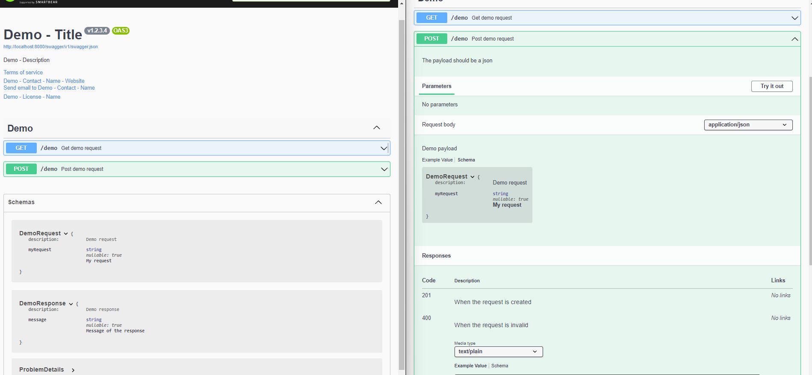

# Demo - .NET Documentation in Swagger UI



## How can I configure Swagger?


### Project configuration

```xml
<Project Sdk="Microsoft.NET.Sdk">

  <PropertyGroup>
    <TargetFramework>net8.0</TargetFramework>

    <RootNamespace>Demo.Contracts</RootNamespace>
    <AssemblyName>Demo.Contracts</AssemblyName>

    <Nullable>enable</Nullable>
  </PropertyGroup>


  <!-- DOCUMENTATION -->
  <PropertyGroup>
    <DocumentationFile>bin\Demo.Contracts.xml</DocumentationFile>
    <GenerateDocumentationFile>true</GenerateDocumentationFile>
    <NoWarn>$(NoWarn);1591</NoWarn> <!-- Prevent XML documentation warnings -->
  </PropertyGroup>


</Project>
```

```xml
<Project Sdk="Microsoft.NET.Sdk.Web">

  <PropertyGroup>
    <TargetFramework>net8.0</TargetFramework>

    <RootNamespace>Demo.Controllers.Api</RootNamespace>
    <AssemblyName>Demo.Controllers.Api</AssemblyName>
    <Version>1.2.3.4</Version>

    <Nullable>enable</Nullable>
  </PropertyGroup>


  <!-- DOCUMENTATION -->
  <PropertyGroup>
    <DocumentationFile>bin\Demo.Controllers.Api.xml</DocumentationFile>
    <GenerateDocumentationFile>true</GenerateDocumentationFile>
    <NoWarn>$(NoWarn);1591</NoWarn> <!-- Prevent XML documentation warnings -->
  </PropertyGroup>


  <ItemGroup>
    <PackageReference Include="Swashbuckle.AspNetCore" Version="6.5.0" />
    <PackageReference Include="Swashbuckle.AspNetCore.Annotations" Version="6.5.0" />
  </ItemGroup>


  <ItemGroup>
    <ProjectReference Include="..\Demo.Contracts\Demo.Contracts.csproj" />
  </ItemGroup>

</Project>
```


### Startup configuration

```csharp
builder.Services
    .AddEndpointsApiExplorer()
    .AddSwaggerGen(options =>
    {
        options.SwaggerDoc(
            "v1",
            new OpenApiInfo
            {
                Version = $"v{Assembly.GetEntryAssembly()?.GetName()?.Version ?? new Version(0, 0, 1)}",
                Title = "Demo - Title",
                Description = "Demo - Description",
                TermsOfService = new Uri("http://demo.fk"),
                Contact = new OpenApiContact
                {
                    Name = "Demo - Contact - Name",
                    Email = "Demo - Contact - Email",
                    Url = new Uri("http://demo.fk/Contact")
                },
                License = new OpenApiLicense
                {
                    Name = "Demo - License - Name",
                    Url = new Uri("http://demo.fk/License")
                },
            });

        // Include XML documentation in swagger
        // Prepared when the solution contains multi projects
        var path = Path.GetDirectoryName(Assembly.GetExecutingAssembly().Location)!;
        foreach(var fileName in Directory.GetFiles(path, "*.xml", SearchOption.AllDirectories))
        {
            options.IncludeXmlComments(fileName);
        }
    });
```


### Controllers documentation

```csharp
[ApiController]
[Route("demo")]
public class DemoController : ControllerBase
{
    /// <summary>
    /// Get demo request
    /// </summary>
    ///
    /// <remarks>
    /// A code example to test
    /// </remarks>
    ///
    /// <response code="200">Demo 200 response</response>
    [HttpGet]
    [ProducesResponseType(typeof(DemoResponse), StatusCodes.Status200OK)]
    public IActionResult Get()
        => Ok(new DemoResponse
        {
            Message = "Demo response"
        });

    /// <summary>
    /// Post demo request
    /// </summary>
    ///
    /// <remarks>
    /// The payload should be a json
    /// </remarks>
    ///
    /// <param name="request">Demo payload</param>
    ///
    /// <response code="201">When the request is created</response>
    /// <response code="400">When the request is invalid</response>
    [HttpPost]
    [ProducesResponseType(StatusCodes.Status201Created)]
    [ProducesResponseType(StatusCodes.Status400BadRequest)]
    public IActionResult Post(DemoRequest request)
    {
        if(string.IsNullOrWhiteSpace(request.MyRequest))
        {
            return BadRequest();
        }

        return Ok(new DemoResponse
        {
            Message = request.MyRequest
        });
    }
}
```

### Models documentation

```csharp

/// <summary>
/// Demo request
/// </summary>
public class DemoRequest
{
    /// <summary>
    /// My request
    /// </summary>
    public string? MyRequest { get; set; }
}

/// <summary>
/// Demo response
/// </summary>
public class DemoResponse
{
    /// <summary>
    /// Message of the response
    /// </summary>
    public string? Message { get; set; }
}
```
